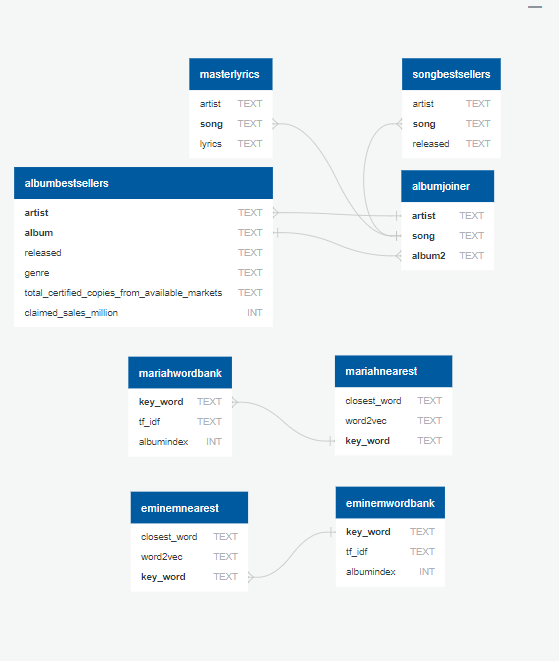
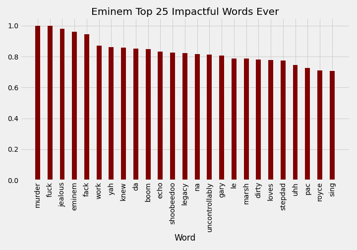
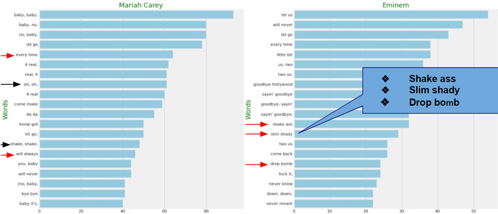

# MelodyVest : NLP on Song Lyrics of Eminem and Mariah Carey
## Background
We are a diverse, multilingual group of technophiles specializing in data sciences and artificial intelligence. We leveraged open source and proprietary inforamtion to predict future outsomce based on history. We began by asking <i> What makes an album/artist great?</i> It's a mix of melody, lyrics, tempo, style, and beat and we have looked into understanding the a lyrics contributions to a songs popularity and sales. 

## Data Infrastructure
A database with over 6,000 + lyrics, from 80 of the best-selling artists. 

## Data PreProcessing
* Removing special characters
* Lower-case
* Removing stop words 

## TF-IDF Lyrical Analysis
Eminem top 25 words revealed that his lyrics feature more colorful langauge that is often assoicated with violence. 

 
Whereas, Mariah Carey's top 25 words are more associated with love and relationships.

## Bigram & Trigram Lyrical Analysis
[Here](https://eminemmariahscatter.s3.amazonaws.com/index.html.html) is an interactive plot that allows you to see where Mariah and Eminem share the most lyrics and where they being to converge. 

Bigram and Trigram's allowed for the analysis of phrases made up of either 2 or 3 words.
The bigram revealed most 2-phrases featured in Mariah's music is focused on relationships, whereas there's more variet in Eminem's lyrics, but tonaly the lyrics are darker in tone, with phrases like 'drop bomb' and 'let go'.

## Final Thoughts
Based on the artists that we analyzed it seems that love and relationships are popular lyricals and bode well with the public lyrics that are darker and more suggestive also find sucess. Some things to consider for the future are an analysis that covers the scope of a song including lyrics, BPM, and genre.  
